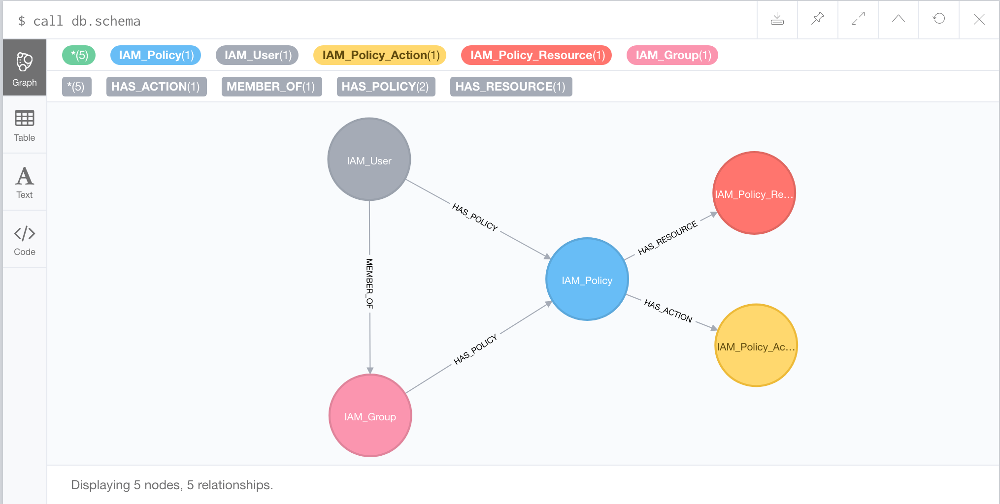

# aws-iam-neo4j

## Export IAM Settings of your account

Run the following command to extract all your AWS IAM settings:

```bash
./aws_iam_export.sh [output_file]
```

If no output file is specified, it defaults to `account_auth.json`.

## Enable JSON import on Neo4j

Enable in the Neo4j configuration:

```
apoc.import.file.enabled=true
```

For Neo4j 5.x, ensure APOC is installed and configured.

## Load Data into Neo4j

Update the file path in `aws_iam_load.cypher` to point to your `account_auth.json` file.

For example:
- Windows: `file:///C:/path/to/account_auth.json`
- Unix/Linux: `file:///home/user/account_auth.json`

Then run the Cypher script in Neo4j Browser or Cypher Shell.

## Graph Schema

The updated schema includes new nodes for:
- IAM_InlinePolicy
- IAM_PermissionsBoundary
- IAM_Tag
- IAM_RoleLastUsed
- IAM_InstanceProfile
- IAM_Principal
- AWS_Service

Relationships:
- HAS_INLINE_POLICY
- HAS_MANAGED_POLICY
- HAS_PERMISSIONS_BOUNDARY
- HAS_TAG
- LAST_USED
- ASSOCIATED_WITH
- CAN_ASSUME_ROLE



## Relevant Cypher Queries

### Show me a specific Policy and all related Relationships
```
MATCH (p:IAM_Policy)-[]->(n)
WHERE p.name = '<PolicyName>'
RETURN n,p
```

### Show me all Users
```
MATCH (u:IAM_User) RETURN u
```

### Show me all Users and their Groups
```
MATCH (u:IAM_User)-[:MEMBER_OF]->(g:IAM_Group) RETURN u,g
```

### Show me all Groups with at least one User
```
MATCH (u:IAM_User)-[:MEMBER_OF]->(g:IAM_Group)
WITH count(u) as n, u, g
WHERE n > 0
RETURN u, g
```

### Show me all Roles
```
MATCH (r:IAM_Role) RETURN r
```

### Show me all Roles with at least one Policy attached
```
MATCH (r:IAM_Role)-[:HAS_MANAGED_POLICY]->(p:IAM_Policy)
WITH count(p) as n, r, p
WHERE n > 0
RETURN r, p
```

### Show me the Policies, its Resources and Actions, and Users with Access
```
MATCH (r:IAM_PolicyResource)<-[:HAS_RESOURCE]-(p:IAM_Policy)<-[:HAS_MANAGED_POLICY]-(u:IAM_User)
MATCH (a:IAM_PolicyAction)<-[:HAS_ACTION]-(p:IAM_Policy)
RETURN r, p, u, a
```

### Show me all Users with Permissions Boundaries
```
MATCH (u:IAM_User)-[:HAS_PERMISSIONS_BOUNDARY]->(pb:IAM_PermissionsBoundary)
RETURN u, pb
```

### Show me all Roles with Tags
```
MATCH (r:IAM_Role)-[:HAS_TAG]->(t:IAM_Tag)
RETURN r, t
```

### Show me Roles that have not been used recently
```
MATCH (r:IAM_Role)
OPTIONAL MATCH (r)-[:LAST_USED]->(rlu:IAM_RoleLastUsed)
WHERE rlu IS NULL OR rlu.lastUsedDate < datetime() - duration('P30D')
RETURN r, rlu
```

### Show me Services that can assume Roles
```
MATCH (s:AWS_Service)-[:CAN_ASSUME_ROLE]->(r:IAM_Role)
RETURN s, r
```

### Show me Inline Policies for a specific User
```
MATCH (u:IAM_User {name: '<UserName>'})-[:HAS_INLINE_POLICY]->(p:IAM_InlinePolicy)
RETURN p
```

### Show me all Instance Profiles and their associated Roles
```
MATCH (ip:IAM_InstanceProfile)-[:ASSOCIATED_WITH]->(r:IAM_Role)
RETURN ip, r
```